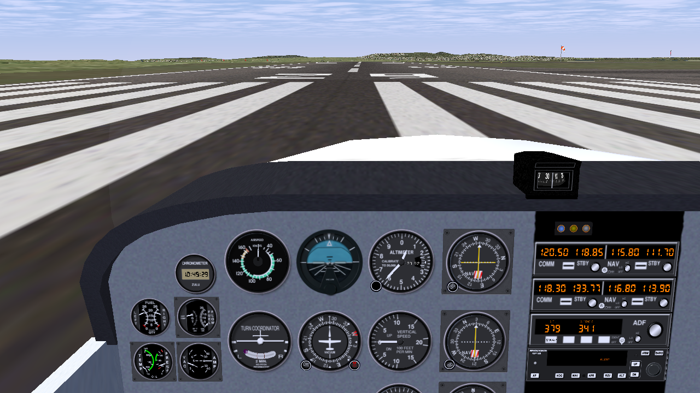
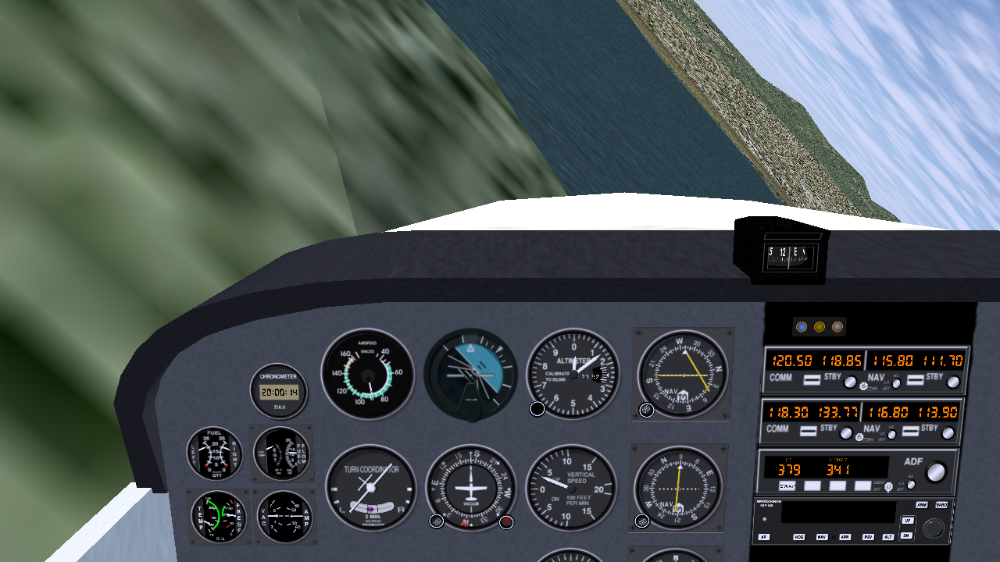

# FlightGear 0.9.10 for the PlayStation 3

The open-source flight simulator [FlightGear](https://www.flightgear.org/) in its
2006 version 0.9.10 (with SimGear 0.3.10 and PLIB 1.8.4), ported to the PS3 as
a homebrew application. You fly by **tilting the controller**: the Sixaxis /
DualShock 3 motion sensors drive aileron and elevator.




*Screenshots from RPCS3.*

## Status

Works:

- the full simulator: JSBSim, YASim and LaRCsim flight models, 3D cockpits and
  instruments, scenery, sky, clouds, HUD, Nasal scripting, autopilot
- scenery for Central Europe, 10-20 E / 40-50 N (from FlightGear's World
  Scenery 2.12: Vienna, Munich, Salzburg, Innsbruck, Budapest, Zagreb,
  Venice, Rome, ...) and the San Francisco Bay Area (from the base package);
  the Cessna 172P starts on runway 29 at Vienna (LOWW)
- the PS3 controller, including tilt steering
- a start screen (the *hangar*) to pick the aircraft and the airport, and to
  download more aircraft from the FlightGear 1.x archive on the PS3 itself
- sound (engine, propeller, wind, warnings) through the PS3's audio output
- the hardware: textures DXT-compressed by the SPUs, with mipmaps and
  anisotropic filtering; sound mixed and terrain read ahead on the PPU's
  second hardware thread; rumble and pressure-sensitive throttle
- stereoscopic 3D for 3D TVs and projectors (720p frame packing) with the
  settings of Gran Turismo 5: on/off, parallax 1-10, convergence 0.00-1.00,
  all changed while running
- about 90-105 MB of main memory in flight (of ~213 MB), 20-45 MB of textures

Not (yet) there:

- mouse and keyboard: the menu bar is hidden because it cannot be used
- the UIUC aircraft (their flight model needs more memory than the PS3 has)

## Installing

You need a PS3 with custom firmware or HEN.

1. Download `FlightGear-0.9.10-PS3.pkg` from the
   [Releases](../../releases) page (252 MB, FlightGear data and scenery included).
2. Install it: copy it to a USB stick and use *Package Manager > Install
   Package Files* in the XMB, or put it into `/dev_hdd0/packages` and install
   it from there (webMAN can do both).
3. Start **FlightGear 0.9.10** from the *Game* column. The hangar comes up;
   choose *Fly* (or press START). The splash screen appears after a few
   seconds; loading the scenery takes a while longer.

## The hangar

The start screen shows the aircraft and the airport of the next flight:

| Input | Action |
| --- | --- |
| d-pad up / down | choose a line |
| cross | open the aircraft list / start (on *Fly*) |
| d-pad left / right | change the airport and runway (Vienna, San Francisco, Oakland, and 16 more in Central Europe) |
| square | 3D on/off (only on a 3D TV or projector) |
| START | fly |

In the aircraft list, the installed aircraft come first, then the ones that
can be downloaded (cross: select or download, triangle: delete a downloaded
aircraft, circle: back). Downloads come over plain HTTP from the
[FlightGear 1.x aircraft archive](https://mirrors.ibiblio.org/flightgear/ftp/Archive/Version-1.x/Aircraft-1.9.1/)
(216 aircraft) and are unpacked into `USRDIR/fgdata/Aircraft`; the PS3 needs
a network connection for that.

Most of these aircraft were made for FlightGear 1.9, not 0.9.10. The port
makes the common differences work (see below); what it cannot fix is
reported:

- when an aircraft loads with problems (parts of its model missing, scripts
  failing), a message says so in the simulator, and the hangar shows a note
  next to it;
- when FlightGear crashes, hangs or stops with an error while loading or
  flying, the hangar says so at the next start, with the matching lines from
  `fgfs.log`.

Tested in RPCS3: the Long-EZ and the Me 262 work fully; the A320 lacks its
cockpit instruments (they come from the 747, which is a separate download);
the An-2 and the A380 load with small problems (some A380 systems scripts need
FlightGear 1.9).

## Controls

| Input | Action |
| --- | --- |
| tilt left / right | aileron (roll) |
| tilt forward / back | elevator (pitch) |
| **SELECT** | take the current controller attitude as neutral |
| right stick | aileron and elevator, like tilting (fine near the centre, 75 % at full deflection) |
| left stick left / right | rudder |
| left stick up / down (full) | elevator trim |
| R2 / L2 | throttle up / down (the harder you press, the faster) |
| cross | brakes |
| circle (hold) | starter |
| triangle | landing gear (retractable aircraft) |
| square | next view |
| d-pad | look around |
| R3 (press the right stick) | look ahead again |
| R1 / L1 | flaps down / up |
| START | pause menu (resume, rumble on/off, 3D on/off, 3D parallax and convergence with left/right, back to the hangar, quit) |

Hold the controller the way that is comfortable and press SELECT once: tilt is
measured from there. If roll or pitch goes the wrong way for you, flip the sign
of `<factor>` for axis 4 (roll) or axis 5 (pitch) in
`USRDIR/fgdata/Input/Joysticks/Sony/ps3-sixaxis.xml`; `<dead-band>` there sets
how calm the tilt steering is. `ps3gl.log` gets a line with the controller's
raw motion sensor values every 600 frames (`pad: ...`), for when tilting does
nothing.

## Aircraft, airports and scenery

`/dev_hdd0/game/FGFS00910/USRDIR/fgfs.args` holds FlightGear's command line,
one option per line (`--timeofday=`, `--prop:...`, ...). The aircraft and the
airport chosen in the hangar replace `--aircraft=`, `--airport-id=` and
`--runway=` from there.

Aircraft: all of the 0.9.10 base package except the UIUC ones (their flight
model needs more memory than the PS3 has): `737-300`, `A-10`, `bf109`, `bo105`,
`c172`, `c172p`, `c310`, `c310u3a`, `Citation-Bravo`, `f16`, `Hunter`, `j3cub`,
`p51d`, `pa28-161`, `Rascal`, `T38`, `ufo`, `wrightFlyer1903`. More come from
the hangar's downloads, or can be copied to `USRDIR/fgdata/Aircraft`.

For aircraft made for FlightGear 1.9 the port adds:

- PNG textures and splash screens (0.9.10 knew only SGI images);
- model parts that refer to files 0.9.10 does not have are left out instead of
  failing the whole model; chrome and heat-haze effects (which need
  multitexturing) are skipped;
- Nasal: listener functions with parameters get the changed node as in 1.9;
  `aircraft.light` understands 1.9's blink patterns; `aircraft.lowpass` and
  `aircraft.timer` exist; `aircraft.livery`, `livery_update` and `data` are
  accepted and do nothing (default livery, nothing saved)
  ([port/fgdata/Nasal/](port/fgdata/Nasal/));
- a Nasal error in the arguments of a call no longer crashes FlightGear (a
  bug in SimGear 0.3.10's interpreter that these aircraft trigger).

Scenery: Central Europe comes from World Scenery 2.12 (2013), the whole
10-20 E / 40-50 N block (95 tiles of 1x1 degrees, 162 MB). Its terrain files
use the format version FlightGear 0.9.10 reads, and its land class, runway
and light materials all exist in 0.9.10, so the tiles load unchanged;
[tools/ws2_install.py](tools/ws2_install.py) only drops scenery objects whose
models 0.9.10 lacks (power pylons, VOR/DME, markers). More areas can be added
the same way from the
[World Scenery 2.12 archives](https://mirrors.ibiblio.org/flightgear/ftp/Scenery-v2.12/)
(see `fetch_scenery.sh`), as long as their terrain files are version 6.
The airport and navaid databases are the full world ones of 0.9.10 (about
35 MB of memory; [tools/regional_db.py](tools/regional_db.py) cuts them down
to regions if memory gets short). Visibility is 20 km (`--visibility=` in
`fgfs.args`).

## Logs

`/dev_hdd0/game/FGFS00910/USRDIR` also holds `fgfs.log` (FlightGear's output)
and `ps3gl.log`, which gets a few lines every 600 frames: memory and draw
statistics, the PPU's time per frame (without the wait for the display), the
controller's raw motion sensor values, the sound mixer, and the terrain
read-ahead. `fetch_logs.sh` copies them from a console running webMAN.

The controller rumbles on touchdown (by sink rate), on the ground, during the
stall warning and after a crash; `--prop:/input/ps3/rumble=0` in `fgfs.args`
switches that off.

## Building

Requirements: Docker, `curl`, `patch`, Python 3 and, for the package, the host
tools of the PS3 toolchain (`make_self_npdrm`, `sfo.py`, `pkg.py`,
`package_finalize` in `$PS3DEV/bin`, default `~/ps3dev/bin`).

```sh
./fetch_sources.sh      # FlightGear, SimGear, PLIB + port/patches -> src/
./dk make -j8           # build/fgfs.run.elf, build/gltest.run.elf
./fetch_data.sh         # FlightGear base data -> fgdata_x/
./fetch_scenery.sh      # Vienna area from World Scenery 2.12
./pkg.sh --full         # FlightGear-0.9.10-PS3.pkg
```

`./dk` runs the build in the Docker image `markstreet/sm64:ps3` (PSL1GHT with
GCC 7.2). `./pkg.sh` without `--full` builds a small package without the data;
`deploy_ps3.sh` uploads the data to a console over FTP instead.

In RPCS3: `./install_rpcs3.sh` puts the game into RPCS3's virtual hard disk,
`./run_rpcs3.sh fgfs` starts it, `./stop_rpcs3.sh` stops it.
`tools/test_aircraft.sh long-ez me262 ...` starts each aircraft in turn
(`--no-hangar` in `fgfs.args` skips the start screen) and collects the result,
the log errors and a screenshot in `logs/actest/`. After changing sources in
`src/`, `tools/mkpatches.sh` regenerates `port/patches/`. Aircraft installed in
RPCS3 that are not part of the base package stay out of the packages and the
console upload. `tools/aircraft_catalog.py` builds the hangar's list
(`port/fgdata/Hangar/catalog.txt`) from the archive's zip files.

## How it works

- **ps3gl** ([ps3gl/](ps3gl/)): the OpenGL 1.x subset that FlightGear and PLIB
  use, on top of the RSX through PSL1GHT's librsx. The fixed-function pipeline
  (transform, lighting, fog, texture environments) is one Cg vertex program and
  a handful of fragment programs; display lists are compiled into vertex
  buffers in video memory. Textures get a mipmap chain and are compressed to
  DXT1/DXT5 by up to six SPU threads ([ps3gl/spu/](ps3gl/spu/), with
  [stb_dxt](https://github.com/nothings/stb)); they are sampled trilinear with
  8x anisotropic filtering. The scene is drawn into a multisampled target that
  the blit engine scales down before each flip. `gltest/` is its self-test.
- **threads**: sound is mixed on a PPU thread of its own
  ([port/al_ps3.c](port/al_ps3.c), the OpenAL subset SimGear uses), terrain
  files are read ahead on another ([port/btg_prefetch.cxx](port/btg_prefetch.cxx));
  the main thread keeps the simulation and the scene graph, as PLIB is not
  thread-safe.
- **port** ([port/](port/)): the window and OS layer, the controller as a PLIB
  joystick (with the tilt axes), stubs for OpenAL, serial ports, render
  textures and Nasal threads, PNG textures (libpng), and the hangar
  ([port/hangar/](port/hangar/): drawn with ps3gl and PLIB's fonts,
  non-blocking HTTP download, zip unpacking with zlib).
- **patches** ([port/patches/](port/patches/)): the changes to FlightGear,
  SimGear and PLIB, kept small. Notable ones: FlightGear runs on the primary
  thread; the UIUC flight model's 118 MB data block is allocated on demand;
  an undefined-behaviour loop in the Morse code generator that GCC 7 turned
  into an endless loop; Nasal's `naCall()` set its error handler only after
  setting up the arguments; timers with zero delay could run endlessly
  within one frame.
- **build**: `-mminimal-toc` (with a TOC split into groups, ld missed r2
  switches on some calls), and no optimisations that exploit undefined
  behaviour (`-fno-strict-aliasing -fno-aggressive-loop-optimizations
  -fno-delete-null-pointer-checks`).

## License

FlightGear is GPL v2, SimGear and PLIB are LGPL v2, the FlightGear data is
GPL v2. The code in this repository is GPL v2 or later, see [LICENSE](LICENSE).
